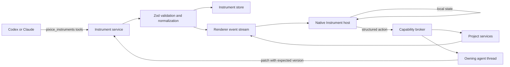

# Generative instruments implementation plan

## Recommendation

Build this as a native Pixice system called **Instruments**.

An Instrument is an agent-authored, Pixice-rendered interface made for one problem. It can display project information, hold local interaction state, send structured input back to an agent, and eventually invoke narrowly scoped Pixice capabilities.

The product promise is simple:

> Every project can grow the tools it needs.

The important architectural choice is that agents do not generate React, HTML, JavaScript, CSS, or Electron code. They generate a validated document. Pixice renders that document with trusted native components and performs actions through named, validated capabilities.

This preserves the surprising part of the idea without turning every agent response into a renderer security boundary.

## Implemented beta slice

The core beta is now in the codebase. Codex and Claude share the `pixice_instruments` tool namespace and the same versioned document contract. Instruments persist in SQLite, open as thread-isolated Preview tabs, update through optimistic version checks, and disappear when their owning thread is archived or deleted.

The native renderer supports stack, grid, split, card, and tab layouts. It also supports text, metrics, tables, graphs, charts, status lists, code, diffs, inputs, text areas, selects, toggles, ranges, and buttons. Bindings read `$state`, `$data`, and `$event`. Local actions can set or reset state and open a URL or project-relative file through the existing Preview path.

Live sources can read bounded snapshots of project metadata, Git status and diffs, text files, board tasks, workflows, workflow run output, and the owning task's plan. Instruments can refresh those snapshots manually, on open, or after matching board, workflow, and task-plan events. A deliberate `sendAgentEvent` action starts or steers the owning thread and records delivery history in SQLite.

Users can now pin an Instrument as a reusable project tool. A dedicated Tools workspace supports search, typed launch parameters, library names, duplication, deletion, capability narrowing, usage and error metadata, action receipts, and document history restore. Restoring a document revision leaves the current grant set untouched. Pinned Instruments appear across project threads, survive creator-thread archival, send interactions to the thread currently using them, and reject agent-authored document updates until the user unpins them.

The first trusted capability set is deliberately small. A confirmed `invokeCapability` action may create, update, or move a board task, or start an existing workflow. Main resolves a concrete effect summary and target version before confirmation. Duplicate requests return the original receipt, and changed targets fail before mutation. Instruments still cannot edit files, run commands, make arbitrary API calls, access credentials, delete board tasks, or edit workflow definitions directly.

## What the experience should feel like

1. The user asks for help with a problem.
2. The agent decides that an interactive Instrument will communicate or solve it better than prose.
3. Pixice opens the Instrument in the current thread's Preview workspace.
4. The user filters, selects, drags, tunes, annotates, or compares directly in the Instrument.
5. Local interactions update immediately without model calls.
6. An action such as `Investigate selected modules` sends a small structured event to the owning thread.
7. The agent continues the task and patches the Instrument as results arrive.
8. A useful Instrument can be pinned to the project and reused. A disposable one disappears with the task.

The Instrument should feel like part of Pixice, not a webpage embedded inside Pixice. It uses Pixice typography, spacing, controls, focus behavior, Dither charts, and color tokens.

## Product principles

- **Purpose-built.** An Instrument should exist because interaction helps with the current problem.
- **Native.** Pixice owns rendering, accessibility, focus, error states, and theme behavior.
- **Provider-neutral.** Codex and Claude create and update the same document format.
- **Local first.** Instrument documents, grants, and interaction history stay in Pixice's local project state.
- **Fast without a model.** Filtering, selection, formulas, layout, and local state changes happen in the renderer.
- **Small model loop.** Only actions that require judgment send events to an agent.
- **Visible authority.** Read and write capabilities are named in the Instrument chrome. No hidden access.
- **Ephemeral first.** The default Instrument belongs to one thread. Saving it to a project is an explicit user action.
- **Progressive power.** Start with display and local interaction. Add live reads, then agent events, then bounded writes.

## Terms

- **Instrument document:** The validated JSON description of layout, data, state, bindings, and actions.
- **Instrument host:** The trusted React renderer inside Pixice.
- **Primitive:** A native component such as a table, graph, chart, diff, form, or timeline.
- **Capability:** A named operation exposed by Pixice, such as `git.diff` or `board.move`.
- **Binding:** A safe expression that connects state or data to a primitive property.
- **Instrument event:** A structured user interaction sent to the owning agent.
- **Pinned Instrument:** A reusable project tool with a reviewed capability manifest.
- **Ephemeral Instrument:** A thread-scoped tool that is removed when its task is deleted or archived.

## Capability model

### Tier 0: presentation

These primitives are inert and safe to render from validated data.

| Primitive | Useful for |
| --- | --- |
| Text and markdown | Explanations, instructions, findings |
| Metric | Counts, timings, confidence, cost |
| Table | Files, tests, issues, alternatives |
| Tree | Packages, files, nested plans |
| Graph | Dependencies, architecture, agent relationships |
| Timeline | Traces, releases, execution history |
| Chart | Performance, usage, comparisons |
| Diff | Code, configuration, structured before and after |
| Code | Read-only snippets with file and line metadata |
| Image | Screenshots and generated visual references |
| Status list | Checks, tests, tasks, run state |
| Tabs, grid, stack, split pane, card | Composition and layout |

### Tier 1: local interaction

These change only Instrument-local state.

| Interaction | Example |
| --- | --- |
| Select and multi-select | Pick modules for investigation |
| Filter, search, sort | Narrow a large test or file table |
| Range, toggle, select, segmented control | Tune parameters or compare scenarios |
| Expand and collapse | Explore trees and nested evidence |
| Drag and reorder | Prioritize options or rearrange a proposed flow |
| Graph positioning and grouping | Reshape an architecture proposal |
| Annotation | Attach a note to a node, row, image region, or diff |
| Local formulas | Recalculate metrics and charts from state |

Tier 1 must never invoke the network, filesystem, shell, workflow runtime, board, or an agent.

### Tier 2: project reads

Read capabilities are resolved by the Electron main process and return bounded JSON.

Initial capabilities:

- `project.summary`
- `files.readText`
- `files.list`
- `git.status`
- `git.diff`
- `git.history`
- `board.list`
- `workflows.list`
- `workflows.inspect`
- `workflows.runs`
- `tasks.current`
- `tasks.agents`
- `tasks.plan`
- `browser.inspect`
- `browser.screenshot`

Every read declaration contains a capability name, validated arguments, a refresh policy, and a byte or row limit. Instruments never receive credentials or raw filesystem handles.

### Tier 3: agent collaboration

These interactions make the Instrument feel alive.

- `agent.sendEvent` sends a typed event to the owning thread.
- `agent.startTask` creates a visible child task after the user activates the action.
- `agent.followUp` sends a bounded follow-up to a selected existing child.
- `instrument.patch` lets the agent replace data or document sections with optimistic concurrency.
- `instrument.setStatus` exposes working, waiting, failed, and complete states in native chrome.

An event contains only the Instrument ID, document version, action ID, selected values, local state explicitly listed by the action, and annotations. The model does not receive the whole Instrument document unless it asks to inspect it.

### Tier 4: bounded project actions

Actions run through the same validated main-process services as Pixice's native UI and workflows.

Good initial actions:

- `resource.open`
- `files.proposePatch`
- `board.create`
- `board.move`
- `workflow.run`
- `workflow.open`
- `browser.navigate`
- `review.openDiff`

Actions fall into three classes:

| Class | Behavior |
| --- | --- |
| Navigation | Runs immediately because it changes only Pixice view state |
| Reversible project mutation | Shows the exact target and effect before execution when risk warrants it |
| Agent work request | Starts or steers a normal task using the thread's permission mode |

Do not expose arbitrary shell commands, unrestricted HTTP, raw SQL, raw file writes, credentials, arbitrary browser script injection, or generic IPC from Instrument documents.

### Tier 5: reusable project tools

A user can pin an Instrument to the project. Pinning creates a durable object with:

- Name, description, and icon
- Instrument document and schema version
- Declared capabilities and scopes
- Owner project and source thread
- Version history
- Optional input parameters
- Last successful use and recent errors
- A manual update path

Pinned Instruments appear in a project Tools section and can be opened without finding the original conversation.

Agents may propose pinning. Only the user pins or widens capabilities.

## Instrument document

Use a new `pixice-instrument` contract. Do not stretch `pixice-visualization` until it becomes an application language. The existing visualization contract remains the compact format for in-chat quantitative visuals.

Suggested top-level shape:

```json
{
  "version": 1,
  "title": "Authentication dependency lab",
  "description": "Select modules and ask Pixice to investigate a proposed boundary.",
  "layout": {
    "type": "split",
    "direction": "horizontal",
    "children": [
      { "type": "graph", "data": "$data.dependencies", "selection": "$state.modules" },
      {
        "type": "stack",
        "children": [
          { "type": "statusList", "items": "$computed.selectedChecks" },
          { "type": "textArea", "id": "constraint", "label": "Constraint" },
          { "type": "button", "label": "Investigate selection", "action": "investigate" }
        ]
      }
    ]
  },
  "state": {
    "modules": [],
    "constraint": ""
  },
  "data": {
    "dependencies": []
  },
  "actions": {
    "investigate": {
      "type": "agent.sendEvent",
      "event": "investigate_modules",
      "payload": {
        "modules": "$state.modules",
        "constraint": "$state.constraint"
      }
    }
  }
}
```

### Document restrictions

- Strict JSON only
- No functions, scripts, HTML, CSS, URLs in markup, or executable expressions
- Maximum document size, data size, primitive count, nesting depth, and collection length
- Stable IDs for interactive primitives and actions
- Unknown primitive types or properties fail validation
- Text lengths and numeric ranges are bounded
- Images must be project-scoped resources, Pixice-generated assets, or validated data URLs under a size limit
- Layout uses Pixice tokens rather than arbitrary styling
- Bindings use a small expression grammar, not JavaScript

### Expression language

Reuse and extend the safe template semantics already used by workflows:

- `$state.path`
- `$data.path`
- `$input.path`
- `$context.path`
- `$item.path`
- `length()`, `number()`, `string()`, `boolean()`, `lower()`, `upper()`
- Safe comparisons, conditional selection, mapping, filtering, sorting, and simple arithmetic

Expressions operate on JSON-compatible values and have depth, operation, and collection limits. They cannot allocate unbounded data or access global objects.

## Architecture



### Renderer

Add a native Instrument workspace to Preview.

Main pieces:

- `InstrumentHost`
- `InstrumentPrimitiveRegistry`
- `InstrumentLayout`
- `InstrumentStateProvider`
- `InstrumentActionDispatcher`
- `InstrumentErrorBoundary`
- `InstrumentChrome`
- `InstrumentEmptyState`

The host recursively renders normalized primitives from a registry. It never resolves component names dynamically from imports and never uses `dangerouslySetInnerHTML`.

Refactor the current Preview workspace tab model into a discriminated union:

```text
browser | file | workflow | instrument
```

This removes the current special handling where browser tabs and file tabs are separate collections. It also gives future native surfaces a clean home.

Instrument chrome should show:

- Instrument title and status
- Owning thread
- Ephemeral or pinned state
- Capability summary such as `Reads Git and tasks`
- Refresh, reset, duplicate, and pin controls
- Error and stale-data indicators

### Electron main process

Add an `InstrumentService` that owns validation, persistence, capability resolution, and events.

Suggested modules:

```text
electron/instruments/instrument-model.mjs
electron/instruments/instrument-store.mjs
electron/instruments/instrument-service.mjs
electron/instruments/instrument-capabilities.mjs
electron/instruments/instrument-tool-shapes.mjs
electron/instruments/instrument-expressions.mjs
electron/instruments/instrument-events.mjs
```

The main process remains the authority for project and thread scope. The renderer passes IDs, not paths or service objects.

### Agent tool surface

Add the provider-neutral `pixice_instruments` namespace.

Recommended tools:

| Tool | Purpose |
| --- | --- |
| `describe_contract` | Return primitives, limits, expressions, and available capabilities |
| `create_instrument` | Validate, persist, and open a new thread-scoped Instrument |
| `inspect_instrument` | Return the current document, version, state summary, and grants |
| `update_instrument` | Replace the document using `expectedVersion` |
| `set_instrument_data` | Replace one named bounded dataset without resending the layout |
| `set_instrument_status` | Update working or completion state |
| `open_instrument` | Open an existing Instrument in Preview |
| `list_instruments` | List thread and project Instruments |
| `delete_instrument` | Delete an ephemeral Instrument created by the same thread |

Start with complete document replacement plus optimistic concurrency. JSON Patch is compact, but it adds a second complex validation surface before there is evidence that document replacement is too expensive.

The `create_instrument` result returns the Instrument ID, normalized document version, rejected or downgraded properties, and whether Preview opened successfully.

### Provider integration

Codex can receive the namespace through the existing dynamic-tools array.

Claude needs an SDK MCP server following the existing Pixice board and bridge pattern. The same Zod shapes should generate both tool definitions where possible so the two providers cannot drift.

Provider instructions should say:

- Use an Instrument only when interaction materially improves the task.
- Prefer prose for simple facts and one-step actions.
- Call `describe_contract` before using unfamiliar primitives or capabilities.
- Keep the first document small and useful.
- Use local interaction for filtering and tuning.
- Send only judgment-requiring actions back to the model.
- Do not imitate approval, credential, terminal, or system UI.

### Persistence

Use a dedicated `pixice-instruments.sqlite` store, following the workflow store pattern. This keeps the main project database smaller and allows Instrument lifecycle work to evolve independently.

Suggested tables:

```text
instruments
  id, project_id, thread_id, title, description, lifecycle,
  schema_version, document_version, document_json,
  status, created_at, updated_at, last_opened_at

instrument_grants
  instrument_id, capability, scope_json, granted_by,
  created_at, updated_at

instrument_events
  id, instrument_id, document_version, action_id,
  event_type, payload_json, status, result_json, error,
  created_at, completed_at

instrument_datasets
  instrument_id, name, version, data_json, updated_at
```

Keep event history bounded. Large datasets should have per-dataset limits and should not be copied into every document revision.

### Renderer IPC

Expose only narrow methods through preload:

```text
instruments.list
instruments.read
instruments.open
instruments.close
instruments.dispatch
instruments.resetState
instruments.pin
instruments.unpin
instruments.delete
```

Agent updates arrive through the existing renderer event channel as `InstrumentCreated`, `InstrumentUpdated`, `InstrumentDeleted`, and `InstrumentActionUpdated`.

The renderer never invokes project capabilities directly from arbitrary document fields. It sends a validated Instrument action ID to main. Main reloads the authoritative document and resolves the action there.

## Trust and security model

### Non-negotiable boundary

An Instrument is data, not code.

The following remain forbidden in version 1:

- Agent-authored JavaScript, TypeScript, JSX, HTML, CSS, SVG, or WebAssembly
- `eval`, dynamic imports, inline event handlers, or `dangerouslySetInnerHTML`
- Raw Electron IPC channel names
- Arbitrary shell commands
- Raw filesystem paths outside validated project resources
- Direct credential access
- Arbitrary HTTP requests
- Browser DOM script injection
- Instrument-controlled permission prompts
- Visual imitation of Pixice approval or credential UI

### Capability checks

Every action is checked against:

1. Instrument project and thread ownership
2. Current document version
3. Declared capability and scope
4. Current user or thread permission mode
5. Target existence and project containment
6. Payload schema and size limits
7. Required confirmation or approval

Pinned Instruments do not inherit broader authority when opened from another thread. Grants belong to the Instrument and can still be narrowed by the active project's policies.

### Interaction integrity

- Native chrome visually separates Instrument content from Pixice controls.
- Buttons that mutate project state show a native effect label.
- The main process renders confirmation details from the resolved capability call, not from agent-authored text.
- Stale documents cannot execute actions.
- Action IDs are single-purpose and cannot choose an arbitrary capability at click time.
- An Instrument cannot hide its capability summary.

## First vertical slice

Build an **Architecture Lab**.

The agent analyzes a repository and creates an Instrument with:

- A React Flow dependency graph
- File and package filters
- Multi-selection
- A side panel with selected module details
- A constraint text field
- An `Investigate selection` action
- A findings table that the agent updates
- Links that open files in the existing Preview editor

Why this is the right first demonstration:

- React Flow is already installed and used by workflows.
- It works on many repositories without app-specific instrumentation.
- It demonstrates a genuinely custom workspace, not a dashboard.
- Local graph interaction is obvious and fast.
- The agent event loop is useful without granting writes.
- It exercises file links and Preview integration.

The first slice should not edit code from the Instrument. After the user investigates and decides, the agent continues through the normal task flow and permission model.

## Delivery phases

### Phase 0: contract spike

Goal: prove that a strict document can express a useful custom tool.

Work:

- Define `InstrumentDocumentV1` and limits.
- Extract reusable normalization patterns from inline visualizations.
- Build 8 to 10 primitives: stack, grid, split, text, button, input, table, graph, status list.
- Render a hard-coded Architecture Lab in a standalone component test.
- Confirm keyboard navigation and reduced-motion behavior.
- Threat-model the document and action boundaries.

Exit criteria:

- No executable content enters the renderer.
- A hard-coded Architecture Lab supports selection, filtering, and local state.
- Invalid documents fail with a useful native error card.
- A 1,000-node bounded graph does not freeze the renderer.

Estimated effort: 3 to 5 engineering days.

### Phase 1: read-only generated Instruments

Goal: let Codex and Claude create a persistent thread-scoped Instrument and open it in Preview.

Work:

- Add model, normalization, and renderer registry.
- Add Instrument store and IPC.
- Add Preview Instrument tabs.
- Add `pixice_instruments.describe_contract`, `create_instrument`, `inspect_instrument`, `update_instrument`, and `open_instrument`.
- Add Codex dynamic tools and Claude SDK MCP tools.
- Add Instrument renderer events.
- Update runtime instructions.
- Add lifecycle handling for thread archive and project deletion.

Exit criteria:

- Both providers can create the same Instrument document.
- The Instrument automatically opens in the correct thread's Preview workspace.
- Reloading Pixice restores the Instrument.
- Concurrent updates fail with an explicit version conflict.
- The Instrument has no project reads or actions yet.

Estimated effort: 2 to 3 weeks.

### Phase 2: live data and agent event loop

Goal: make Instruments react to project state and user decisions.

Work:

- Add named datasets separate from the layout document.
- Add safe bindings and computed values.
- Add bounded read capabilities for files, Git, tasks, board, workflows, and browser inspection.
- Add refresh policies: manual, on-open, and event-driven.
- Add `agent.sendEvent` actions.
- Route events into the owning thread as structured follow-ups.
- Let agents update status and datasets while working.
- Add action progress and failure states.

Exit criteria:

- Local controls update without a model call.
- A user selection can send one bounded event to the agent.
- The event appears in the conversation as a user-visible structured interaction.
- Agent results patch the existing Instrument rather than creating duplicates.
- Project data changes refresh only affected datasets.

Estimated effort: 2 to 3 weeks.

### Phase 3: trusted actions

Goal: let Instruments do useful work through explicit Pixice capabilities.

Work:

- Add the capability broker.
- Implement navigation actions first.
- Add workflow run, board mutation, and file patch proposal actions.
- Add native effect summaries and confirmation UI.
- Reuse thread permission settings for agent work actions.
- Add stale-version, stale-target, and duplicate-action protection.
- Store bounded action receipts.

Exit criteria:

- Instrument content cannot choose arbitrary targets at click time.
- Mutating actions show a main-process-derived effect summary.
- Denied or stale actions fail without partial effects.
- File changes still travel through normal task review and Git diff surfaces.
- Instrument actions behave consistently across Codex and Claude threads.

Estimated effort: 3 to 4 weeks.

### Phase 4: project tool library

Goal: let good ephemeral Instruments become durable project tools.

Work:

- Add pin, duplicate, unpin, and delete flows.
- Add a Tools section to project navigation.
- Add input parameters and a launch form.
- Add capability review and grant narrowing.
- Add version history and restore.
- Add Instrument templates and a small native gallery.
- Add usage, error, and last-opened metadata.

Exit criteria:

- A user can pin a thread Instrument and reopen it from the project.
- Pinning clearly shows requested capabilities.
- Project tools survive deletion of their source thread.
- Restoring a prior document version does not silently restore wider grants.

Estimated effort: 2 to 3 weeks.

### Phase 5: richer project-specific instruments

Goal: enable deeper tools without weakening the trusted boundary.

Candidates:

- Runtime trace and performance data adapters
- Test-run streaming
- Browser element selection and screenshot-region annotations
- Design token and component catalog data
- Editable diagrams that compile into agent events
- Instrument composition, where one Instrument embeds another by ID
- Workflow output as a live dataset
- Signed plugin-provided primitives with a separate installation trust flow

Do not start a general custom-primitive SDK until native primitives have clear gaps. Arbitrary plugin renderers belong to the plugin trust model, not the Instrument document model.

## Work breakdown

| Epic | Depends on | Main output |
| --- | --- | --- |
| Instrument schema and normalizer | None | Strict V1 contract and errors |
| Native primitive registry | Schema | Trusted renderer |
| Unified Preview tabs | None | Browser, file, workflow, and Instrument tabs |
| Instrument store | Schema | Durable documents, data, events, grants |
| Main-process service and IPC | Store | Scoped renderer operations |
| Codex tool namespace | Service | Agent creation and updates |
| Claude MCP server | Service | Provider parity |
| Safe bindings | Schema and host | Reactive local interaction |
| Read capability registry | Service | Live project data |
| Agent event router | Service and thread runtime | Bidirectional collaboration |
| Action capability broker | Reads and event router | Trusted bounded effects |
| Project Tools library | Persistence and grants | Reusable Instruments |

## Likely code touchpoints

Existing files that should be extended carefully:

- `src/App.jsx` for Preview integration and thread workspace state
- `src/components/InlineVisualization.jsx` as a normalization and reactive-value precedent, not as the Instrument implementation
- `src/components/workflows/*` for React Flow and canvas patterns
- `electron/main.mjs` for service installation, IPC, and tool routing
- `electron/preload.cjs` and `src/pixice-api.d.ts` for the narrow renderer bridge
- `electron/providers/claude-provider.mjs` for the Claude SDK MCP server
- `resources/runtime/pixice-developer-instructions.md` for provider-neutral usage guidance
- `electron/workflows/workflow-values.mjs` for safe expression concepts
- `electron/persistence/database.mjs` only if project deletion needs to coordinate Instrument cleanup

Most new logic should live under `electron/instruments/` and `src/components/instruments/` so `App.jsx` and `main.mjs` remain integration points rather than implementations.

## Test plan

### Schema and expression tests

- Reject unknown primitives and fields.
- Reject executable strings and unsafe resource schemes.
- Enforce size, depth, node, dataset, and expression limits.
- Verify deterministic normalization.
- Verify expressions cannot access prototypes or global objects.

### Renderer tests

- Render every primitive and layout.
- Exercise keyboard navigation, focus return, screen-reader labels, and reduced motion.
- Verify local state and computed bindings.
- Verify one broken primitive cannot crash the task workspace.
- Verify large bounded tables and graphs remain responsive.

### Scope and security tests

- Reject cross-project Instrument reads and actions.
- Reject stale versions and replayed action IDs.
- Reject capabilities missing from the manifest.
- Verify path containment with multi-folder projects and symlinks.
- Verify confirmations are derived from resolved actions.
- Verify pinned Instruments do not inherit source-thread authority.

### Provider tests

- Codex and Claude receive equivalent tool shapes.
- Both can create, inspect, update, and open an Instrument.
- Tool failures return useful model-readable errors.
- Provider disconnects leave persisted Instruments usable.

### Lifecycle tests

- Restart restores Instruments and active tabs.
- Archive hides ephemeral Instruments without deleting pinned ones.
- Project deletion cleans up Instruments, datasets, grants, and events.
- Version conflict recovery preserves both user and agent changes.

## Success measures

Avoid measuring Instrument count. More generated UI is not automatically better.

Useful measures:

- Time from question to useful interaction
- Percentage of Instrument interactions handled locally without model calls
- Percentage of Instruments that receive a second meaningful interaction
- User completion rate after an Instrument appears
- Rate of Instruments pinned for reuse
- Agent event payload size compared with resending full context
- Invalid document and version-conflict rates
- Whether Instruments reduce back-and-forth turns for the tasks that use them

The most important qualitative test is whether users describe an Instrument as "the right tool appeared" rather than "the agent made a dashboard."

## Decisions to make early

### Instruments versus artifacts

Recommendation: call them Instruments. "Artifact" suggests passive output. An Instrument is something the user operates.

### Inline or Preview first

Recommendation: show a compact summary card in conversation and open the full Instrument in Preview. Rich interaction inside a message will fight the transcript layout and make persistence harder.

### Embedded data or live bindings first

Recommendation: ship embedded data in Phase 1, then add live bindings. This proves the document and renderer before creating a general project data API.

### Automatic opening

Recommendation: agents may open a newly created Instrument in the current thread's Preview. They may not steal focus across projects or reopen a dismissed Instrument without a new user request.

### Can agents pin Instruments

Recommendation: agents can propose pinning, but the user performs it. Pinning changes an ephemeral answer into durable project behavior.

### Can Instruments edit files directly

Recommendation: no. An Instrument may propose a patch or ask an agent to implement a decision. Code changes should remain attached to a task, permission mode, and Git review.

## Suggested schedule

For one experienced engineer working in this codebase:

- Read-only generated Instrument beta: roughly 3 to 4 weeks including the contract spike
- Live bidirectional beta: roughly 6 to 8 weeks total
- Action-capable beta: roughly 9 to 12 weeks total
- Reusable project Tools library: roughly 11 to 15 weeks total

Two engineers can parallelize the native renderer and main-process/provider work after the V1 contract is fixed. The contract, trust model, and unified Preview tab model remain early serial dependencies.

## Definition of the first public beta

The first public beta is ready when:

- Codex and Claude can create the same native Instrument.
- Instruments open inside thread-isolated Preview workspaces.
- The primitive set covers tables, graphs, controls, status, code, diffs, charts, and flexible layout.
- Local interaction does not require a model turn.
- A user action can send a structured event to the owning agent.
- Instruments can read a small approved set of project data.
- No agent-authored executable content reaches the renderer.
- Instruments persist across restart and respect project boundaries.
- The Architecture Lab demonstration works on at least three different repository shapes.
- Failure states are understandable without opening developer tools.

That beta is already a meaningful new product category. Bounded writes and reusable project tools can follow without weakening the core story.
