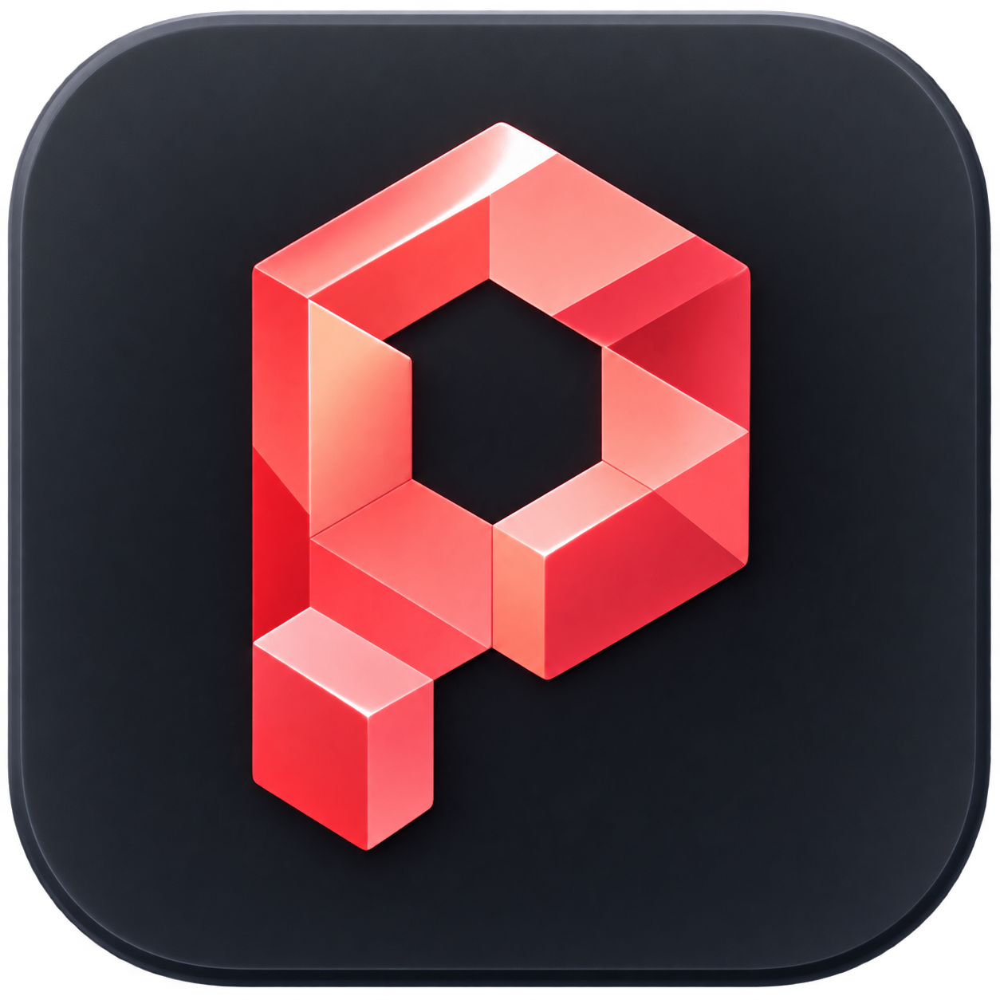

<p align="center">
  
</p>

<h1 align="center">Pixice</h1>

<p align="center">A desktop workspace for Codex and Claude.<br />Follow the work, steer your agents, and review what they changed.</p>

<p align="center">
  <a href="https://github.com/Blumenwagen/Pixice/releases">Download beta</a> ·
  <a href="#what-you-can-do">Features</a> ·
  <a href="#get-started">Get started</a> ·
  <a href="docs/REMOTE.md">Remote access</a> ·
  <a href="https://github.com/Blumenwagen/Pixice/issues">Report a bug</a>
</p>


<p align="center"><sub>Example workspace with sample task content.</sub></p>

Pixice brings your coding agents, project files, browser previews, and Git review into one app. Start a task in a conversation, watch its plan and delegated agents, and step in when it needs a decision. Your provider's threads and project instructions stay part of the workflow.

## What you can do

### Work with Codex and Claude

Choose a connected provider, model, reasoning effort, and permission mode for each task. Continue earlier conversations, steer work while it runs, or interrupt it. Agents can delegate across connected providers, and you can follow the resulting threads and their progress.

Skills, Apps, and MCP servers are visible in the app. Pixice respects your project's `AGENTS.md` and `CLAUDE.md`, with optional Agent Behavior settings for how you want it to work.

### See what is happening

Live plans, tool activity, and the task map show what agents are doing and how delegated work relates to the lead conversation. Attention brings pending approvals and questions together. Review lets you inspect actual Git changes alongside the work that produced them.

### Keep the result beside the conversation

Each thread gets its own Preview workspace with browser tabs, persistent browser sessions, and file tabs. Open a running app, read a PDF, inspect an image, or edit a project file without losing your place in the conversation. Browser sessions and unsaved file drafts stay separate between threads.

On macOS with Xcode installed, agents can also build, launch, and inspect an iOS app in a Simulator preview.

### Turn repeatable work into workflows

Build a visual workflow with API requests, Git inspection, files, SQLite, conditions, loops, and agent steps. Attach Skills to agents and inspect each run's output. Run it manually, or enable schedule, task-event, or local-webhook triggers when you want automation.

Agent steps can run in the background or open as normal task threads you can steer. Use Board and Timeline to track planned work, dates, and dependencies, then connect tasks to workflows where useful.

### Ask for a tool your project needs

Ask an agent for a release checklist, configuration tuner, or project health view. Pixice Instruments turn those requests into native interactive tools in Preview, with controls and project data. Pin a useful one to the project's Tools library to use it again.

Conversations can also contain interactive charts, adjustable scenarios, timelines, and calendars. Supported tool actions, such as creating a Board task or running a workflow, require your confirmation.

### Take the workspace with you

Pixice Connect pairs another browser or Pixice desktop with your host machine. Continue tasks, answer approvals, review changes, and access project files remotely. Code and agent execution stay on the host.

The independent backend keeps tasks and remote access running when you close or quit the interface. You can stop or restart it explicitly in **Settings → Connections → Background backend**. See the [remote access guide](docs/REMOTE.md) for pairing, HTTPS setup, and remote feature limits.

### A few more things

- Local voice transcription, with speech models downloaded on demand in **Settings → Voice**.
- GitHub sign-in and a bundled GitHub CLI for agents working with issues, pull requests, and releases.
- Usage views for tokens, model breakdowns, and API-equivalent cost estimates, including combined usage across paired hosts.
- Background update checks in packaged builds, with user-controlled installation and verified data backups before updates.

## Get started

1. Download a package for your machine from [GitHub Releases](https://github.com/Blumenwagen/Pixice/releases). The signed, notarized release target is macOS on Apple silicon. Windows and Linux packages can also be built through the release workflow; check each release's assets for availability.
2. Open **Settings → Providers** and connect Codex, Claude, or both. Pixice uses external Codex and Claude Code installations, so you need a working provider runtime and its authentication. These runtimes are not bundled with the app.
3. Add a local project folder, start a task, and choose your model and permissions.
4. Describe the work. Follow progress in the conversation, respond to requests in Attention, and inspect the changes in Review.

For GitHub work, connect your account in **Settings → GitHub**. For another device, enable remote access in **Settings → Connections** and create a pairing link.

Pixice is in beta. See [Support](SUPPORT.md) for bug reports, [Privacy](PRIVACY.md) for data handling, and [Security](SECURITY.md) for vulnerability reporting.

## Run from source

Use Node.js **22.20 or newer** and **pnpm 10.15.1**.

```bash
git clone https://github.com/Blumenwagen/Pixice.git
cd Pixice
pnpm install
pnpm dev:electron
```

`pnpm dev:electron` starts the renderer and Electron app together. `pnpm dev` starts only the Vite renderer server.

Pixice discovers installed provider executables. If needed, select explicit binaries with `PIXICE_CODEX_PATH` or `PIXICE_CLAUDE_PATH`. Provider setup and sign-in are available in **Settings → Providers**.

| Command | Purpose |
| --- | --- |
| `pnpm check` | Run unit tests, the Sites renderer build, and Sites packaging tests. |
| `pnpm github:sync` | Download the GitHub CLI for the current platform before desktop packaging. |
| `pnpm build:desktop` | Build and package the desktop app. |
| `pnpm install:local:macos` | Install and relaunch a locally built Apple silicon app. |

The local macOS installer refuses to interrupt active backend work, backs up durable data, and preserves the previous app bundle before replacing it. Release signing, packaging checks, and update publishing are covered in the [release runbook](RELEASE.md). Standalone backend commands are in the [remote access guide](docs/REMOTE.md#standalone-node-commands).

## Attributions

Pixice builds on the work of these projects and their contributors:

- **OpenAI Codex and Anthropic Claude Code**, the external agent runtimes, plus the [Claude Agent SDK](https://github.com/anthropics/claude-agent-sdk-typescript) used for Claude integration.
- **Electron, React, and Vite**, the desktop application and UI foundation.
- **React Flow**, the visual workflow editor, and **Motion**, UI animation.
- **Torph by Lochie Axon**, animated text.
- **The T3 Code Team**, inspiring this project and some of it's features.
- **Dmytro Tovstokor**, the bundled animated icon components. Their [MIT license](src/components/icons/LICENSE) is included in the repository.
- **Manrope and JetBrains Mono**, distributed through Fontsource.
- **GitHub CLI**, bundled with release builds, and **cloudflared**, downloaded on demand for optional HTTPS tunnels.
- **sherpa-onnx and ONNX Runtime**, local speech recognition. Optional speech models come from **NVIDIA, OpenAI, Useful Sensors, and Alibaba**; individual model credits and licenses appear in Voice settings and the notices below.

See [Third-party notices](THIRD_PARTY_NOTICES.md) for license details, source links, and model attributions. Pixice currently has no product license; third-party licenses apply to their respective components and do not grant rights to Pixice itself.
