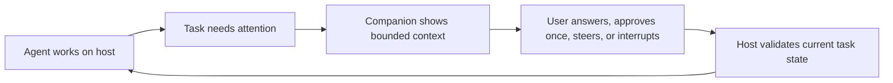
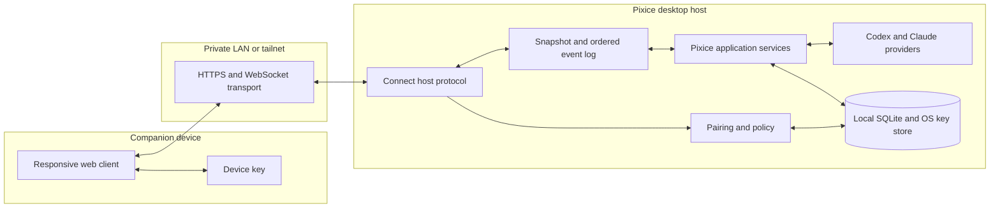

# Pixice Connect product boundary

- Status: accepted
- Date: 2026-08-25
- Decision: ship a private-network web companion before considering a managed public service
- Scope: product and architecture decision only
- Related work: Connect 02 through Connect 07

## Decision

Pixice Connect will begin as **Connect Lite**, a single-user web companion that reaches an opted-in Pixice desktop host over a private network such as a LAN or user-managed tailnet.

The Pixice desktop host remains authoritative for projects, provider sessions, permissions, pending approvals, task state, and local data. The companion receives a bounded snapshot, ordered events, and a small command set for already-running tasks. It does not receive the Electron preload API or a network-shaped copy of it.

Connect Lite will support these remote jobs:

1. Check whether a task is running, blocked, failed, interrupted, or complete.
2. Read the task conversation, plan, agent activity, and attention requests.
3. Send text to an existing task, steer its active turn, or interrupt it.
4. Answer a question or elicitation.
5. Accept one pending approval, decline it, or cancel it.
6. Receive a generic notification that a task needs attention.

The first release will not create tasks, select projects, change models or permission modes, edit files, expose browser sessions, run workflows, administer Pixice, or expose credentials. A task using Auto-review or Full access is visible but cannot be controlled from a remote client.

A managed public service is not approved for implementation yet. The host protocol must leave room for it by separating application messages from transport and identity. Pixice will consider a managed relay only after Connect Lite proves that remote task intervention is useful and that private-network setup is the main adoption barrier.

## Why this is the boundary

Pixice is a local desktop control surface. Its Electron main process currently owns project paths, provider runtimes, approval request IDs, Git inspection, file access, browser sessions, credentials, updates, dialogs, and external app launches. The renderer reaches those capabilities through a named and validated preload bridge.

That bridge is a useful internal boundary, but it is too broad for a network API. A stolen companion credential must not become remote filesystem, terminal, browser, credential, or application administration access.

The useful remote loop is smaller:

Connect Lite tests that loop without making Pixice an internet-facing service or a cloud system of record.

## Product principles

1. Remote access is off by default.
2. The local owner explicitly exposes each project. New projects are not inherited into the remote set.
3. Private network membership is not authentication. Every companion device must pair and authenticate separately.
4. The host decides whether every read and command is allowed. The client never infers authority from UI state.
5. Remote clients cannot increase a task's authority.
6. Commands act on a named host, project, thread, turn, and request generation. Stale commands fail closed.
7. No command that changes task state is queued while the host is offline.
8. The host keeps a local audit record of pairing, revocation, remote reads of sensitive task content, and remote commands.
9. Network payloads use product-level schemas. Provider-specific events and raw Electron IPC never cross the remote boundary.
10. A managed relay, if built, transports data. It does not become authoritative for task or approval state.

## Client and service roles

### Local owner

The signed-in operating-system user running Pixice is the administrative authority. Only the local owner can:

- enable or disable Connect;
- expose or hide a project;
- pair, name, inspect, and revoke devices;
- choose a task's model, reasoning effort, and permission mode;
- create, archive, or delete tasks;
- manage providers, credentials, workflows, Tools, updates, and application settings;
- perform any capability classified as local-only.

### Paired operator

A paired companion is the only remote user role in Connect Lite. It represents the same person as the local owner on another device. It receives project-scoped read access and the bounded task actions listed in this decision.

Connect Lite does not include team membership, invitations, public links, guest access, shared observers, organization administration, or per-person RBAC. The protocol may use scopes internally, but the product exposes one remote operator role.

### Pixice host

The desktop host authenticates devices, authorizes every operation, maps public identifiers to local resources, reads provider state, executes accepted commands, sequences events, and owns the audit log. It does not trust a companion-supplied path, permission mode, provider request, or runtime method.

### Private network

The LAN or user-managed tailnet supplies reachability only. It is not an identity provider and does not replace application pairing, encryption, expiry, or revocation.

### Managed control plane and relay

This role is reserved for a later decision. If approved, it may authenticate the Pixice account, register devices and hosts, help a companion discover an online host, route encrypted messages, deliver generic push notifications, and report relay health.

It must not receive provider credentials, workflow credentials, project files, browser state, raw prompts, task transcripts, approval payloads, or command plaintext. Application payloads must be end-to-end encrypted between a paired companion and its host. Re-pairing is acceptable after account or device recovery.

## Data classification

| Class | Examples | Connect Lite handling |
| --- | --- | --- |
| Public product metadata | Protocol version, capability names, generic error codes | May cross the connection |
| Account and device metadata | Host name, device name, pairing time, last seen, revocation state | Visible to the local owner and the paired device where needed |
| Project metadata | Opaque project ID, display name, task title, status, timestamps | Available only for explicitly exposed projects |
| Project content | Prompts, agent output, plan text, tool summaries, approval context | Encrypted in transit, bounded, and available only for exposed projects |
| Local topology | Absolute paths, environment variables, process details, local ports, stack traces | Never returned remotely |
| Secrets | Provider tokens, GitHub credentials, workflow credentials, cookies, session storage, encryption keys | Local-only and never returned remotely |

Generic push notifications must not contain a project name, task title, prompt excerpt, command, path, or approval detail. They may say only that a named Pixice host needs attention.

## Remote-safe feature set

### Read operations

| Capability | Connect Lite decision | Notes |
| --- | --- | --- |
| Host health and compatibility | Include | Return host display name, availability, protocol version, and coarse runtime state |
| Exposed project list | Include | Return opaque ID and display name, never a canonical path or repository remote |
| Task list and status | Include | Existing tasks only, filtered to exposed projects |
| Conversation history | Include | Normalized user and assistant content with bounded pagination |
| Plans and task progress | Include | Use Pixice's normalized plan model |
| Agent hierarchy and activity | Include | Bounded summaries and status, no raw process output by default |
| Attention inbox | Include | Only current, actionable requests for exposed projects |
| Pending request context | Include | Exact request instance with bounded display fields needed for a safe decision |
| Usage and provider limits | Exclude | Account and billing information stays local in the first release |
| Full Git review and file contents | Exclude | Approval-specific context may include a bounded change summary, not arbitrary reads |
| Board state | Exclude | It is not part of the remote task intervention loop |
| Workflow and Tool state | Exclude | Their data and actions have separate capability models and larger scope |

### Command operations

| Capability | Connect Lite decision | Conditions |
| --- | --- | --- |
| Start a follow-up turn | Include | Existing exposed thread, text only, current local model and permission mode |
| Steer an active turn | Include | Exact current turn ID, text only |
| Interrupt an active turn | Include | Exact current turn ID |
| Answer a question | Include | Exact pending request and generation |
| Answer an elicitation | Include | Exact pending request and generation, schema-bound content |
| Resolve an approval | Include with limits | Accept once, decline, or cancel. No session-wide acceptance |
| Create a task | Exclude | Requires local project, runtime, model, and permission choices |
| Change model, effort, or permission | Exclude | A remote client cannot increase or reshape task authority |
| Control Auto-review or Full access task | Exclude | Such tasks are view-only remotely in Connect Lite |
| Upload files or images | Exclude | Text-only commands keep parsing, storage, and disclosure risk bounded |
| Archive or delete | Exclude | Destructive administration stays local |
| Mutate board state | Exclude | Not required for the first remote loop |
| Run, cancel, create, or edit workflows | Exclude | Workflows can perform network, file, database, board, and agent actions |
| Invoke or edit Tools | Exclude | Tool grants and confirmed actions need a separate remote review |

## Local-only capabilities

The host must not expose these capabilities through Connect Lite:

- project creation, folder selection, canonical paths, and repository remotes;
- arbitrary file reads and writes, project-file editor drafts, and full Git diffs;
- preview browser tabs, cookies, persistent sessions, screenshots, navigation, and interaction;
- terminal, editor, Finder or Explorer, native dialogs, clipboard, and external URL actions;
- provider sign-in, GitHub sign-in, credential values, cookies, tokens, and authentication diagnostics;
- application or runtime update download and installation;
- application settings, default models, permission defaults, and agent behavior packs;
- workflow definitions, triggers, credentials, execution, and run output;
- Tool definitions, grants, revisions, events, and capability invocation;
- extension inventory when it reveals local installation paths, configuration, or authentication state;
- task creation, archive, deletion, worktree lifecycle, and permission escalation;
- raw Electron IPC, raw provider JSON-RPC, raw process output, environment data, and stack traces.

Later decisions may move a capability across this boundary only after a capability-specific threat review. Convenience alone is not enough.

## Architecture decision

### System shape

The Connect host belongs beside Electron main's application services, not inside the renderer and not inside a provider adapter. It calls the same validated domain operations as the local UI after passing remote authentication and capability checks.

The remote protocol is a new product contract. It must not forward IPC channel names or accept raw runtime methods. This prevents future local features from becoming remotely reachable by accident.

### State and event model

The host is the system of record. A client connects with its last accepted event cursor and receives either:

- the missing ordered events, if the cursor is still retained; or
- a fresh snapshot followed by events after that snapshot.

Each event carries a host instance ID, monotonically increasing sequence, protocol version, project ID where applicable, and server timestamp. A host restart changes the instance ID and forces snapshot reconciliation.

Each command carries a unique idempotency key plus the expected resource version. Commands that refer to an approval, question, elicitation, or active turn also carry its exact current identifier and generation. Replayed commands return the recorded result. Stale commands fail without side effects.

The host does not queue control commands while offline. A companion may keep an unsent text draft locally, but it must ask the user to send it after reconnecting.

### Pairing and sessions

Pairing begins on the local host and requires a local confirmation. The pairing offer is short-lived, single-use, and bound to one host. The companion creates or receives a device credential that is stored using the browser platform's strongest available protected storage.

Normal sessions use short-lived access credentials derived from the paired device identity. Refresh or re-authentication proves possession of the device key. The host supports device naming, last-seen inspection, individual revocation, revoke-all, and automatic expiry after a configurable period of inactivity.

All network modes require encryption. LAN mode pins the host identity established during pairing. A tailnet reverse proxy may supply transport encryption, but Pixice still authenticates the paired device and verifies allowed origins.

### Project exposure and authorization

Connect is disabled until the local owner enables it. Enabling the host exposes no project by itself. The owner selects projects individually.

Every request maps an opaque project ID back to a current local project and checks that the project remains exposed. The host performs the same check for events immediately before delivery. Hiding a project closes its active remote subscriptions and invalidates outstanding project-scoped commands.

Remote control requires both:

1. a paired operator device; and
2. a task using Read only or Workspace access.

Auto-review and Full access tasks are view-only. The local owner can hide them entirely if visibility alone is too sensitive. The companion cannot change this policy.

### Audit and privacy

The host stores a bounded local audit log with:

- pairing, authentication failure, expiry, and revocation;
- project exposure changes;
- companion device, action, target, result, and timestamp;
- approval and question request identifier, but no secret values;
- protocol and host instance version used for the action.

Audit records must not copy full prompts, task transcripts, file content, or credentials. The owner can inspect and clear the log locally, subject to a short minimum retention needed for incident review.

Connect Lite has no Pixice cloud data path. Traffic flows directly between the companion and host over the user's private network.

## Threat model

### Assets

- source code, project paths, prompts, agent output, diffs, and attachments;
- authority to steer or interrupt an agent and to answer its questions;
- authority to approve a command or file change;
- provider, GitHub, workflow, browser, and operating-system credentials;
- host availability and integrity;
- device identities, session credentials, and audit records.

### Adversaries and failures

| Threat | Impact | Required control |
| --- | --- | --- |
| Untrusted device on the same LAN or tailnet | Reads tasks or sends commands | Per-device authentication, project authorization, rate limits, and no trust based on source IP |
| Stolen companion device or credential | Acts as the user | Protected key storage, short sessions, device revocation, inactivity expiry, local audit, and bounded permissions |
| Malicious website in the companion browser | Cross-origin command or data theft | Strict origin policy, no cookie-only authentication, CSRF-resistant requests, content security policy, and XSS defenses |
| Network interception or DNS spoofing | Reads or alters project content | Encrypted transport plus host identity pinning established during pairing |
| Replayed or duplicated command | Repeats an approval, prompt, or interrupt | Idempotency keys, expected versions, request generations, and recorded outcomes |
| Stale companion state | Approves the wrong request or steers the wrong turn | Exact resource IDs, generation checks, expiry, and fail-closed reconciliation |
| Malicious prompt or tool output | Tricks the user or crosses permissions | Treat displayed content as untrusted, preserve provider approval boundaries, and never translate content into a host capability |
| Oversized or malformed payload | Memory, storage, or parser denial of service | Strict schemas, text-only commands, byte limits, pagination, timeouts, and connection limits |
| Compromised managed relay | Reads tasks or injects commands | End-to-end application encryption, authenticated envelopes, minimal metadata, and no offline command queue |
| Host compromise or hostile local process | Reads local state or impersonates the host | Out of scope for full prevention. Use OS protections, secure storage, signed builds, and visible host identity |
| Provider outage or host restart | Lost events or uncertain command outcome | Snapshot and cursor resume, host instance IDs, idempotent commands, and explicit unavailable states |

### Explicitly out of scope

Connect does not protect project data from the local operating-system user, a compromised Pixice host, an authorized provider, or an agent action already allowed by the task's current permission mode. It also does not make an untrusted project safe to execute.

## Option comparison

| Criterion | Private-network companion | Managed public service |
| --- | --- | --- |
| User value | Covers remote monitoring and intervention when the user's devices share a LAN or tailnet | Works from ordinary internet connections without user-managed networking |
| Time to validate | Shorter. Reuses the local host and avoids account, relay, and production operations work | Longer. Requires identity, host discovery, NAT traversal or tunnels, abuse controls, recovery, and support |
| Attack exposure | Authenticated service reachable only inside a user-controlled private network | Internet-facing account and relay services with a larger credential and abuse target |
| Pixice data custody | No Connect cloud path | Relay metadata and account data exist even with end-to-end encrypted payloads |
| Reliability owner | Pixice owns host and protocol behavior. The user owns private-network reachability | Pixice also owns relay availability, tunnel health, queue behavior, incident response, and capacity |
| Setup friction | Higher for users without a tailnet or usable LAN routing | Lower after account sign-in and host pairing |
| Operating cost | Near zero beyond normal product development and support | Ongoing compute, bandwidth, observability, abuse prevention, on-call, and support cost |
| Multi-machine discovery | Manual or private-network based | Natural fit for account-backed discovery |
| Product risk | May understate demand from less technical users | Can overbuild infrastructure before proving that remote intervention matters |
| Reversibility | High. The protocol and client remain useful behind a later relay | Lower. Cloud identity and operational commitments are hard to remove |

### Chosen option

Choose the private-network companion first.

This choice tests the smallest useful loop, keeps Pixice local-first, and avoids making cloud operations part of the initial product promise. The protocol will be transport-independent so a managed relay can carry the same authenticated, versioned application messages later.

### Conditions for reconsidering a managed service

A managed relay requires a new architecture and operational-readiness decision. It is eligible for that decision only when Connect Lite meets its utility and reliability gates and evidence shows that private-network setup, rather than weak remote value, blocks adoption.

That later package must settle:

- account identity, recovery, and deletion;
- host discovery and multi-machine selection;
- end-to-end key establishment and device recovery;
- relay topology, regions, capacity, and failure behavior;
- abuse prevention, rate limits, and denial-of-service controls;
- metadata and audit retention;
- push notification providers and privacy;
- support diagnostics, incident response, on-call ownership, and recurring cost;
- security review and penetration testing before public availability.

## Success metrics and gates

Measure Connect Lite during a six-week private beta with at least 30 paired hosts. These are decision gates, not vanity counters.

### Setup and safety gates

- At least 80% of invited users pair a companion without support.
- Median first pairing takes less than five minutes.
- No unexposed project appears in a remote snapshot, event, notification, or error.
- Every remote command has a matching local audit record.
- Revoking a device blocks new sessions and commands within 30 seconds when the host is online.
- Security review finds no unresolved critical or high-severity issue before widening the beta.

### Reliability gates

- At least 99% of commands sent to a reachable host return a definitive result.
- No accepted command produces more than one side effect, including across reconnects.
- The 95th percentile reconnect and state reconciliation time is under five seconds on a healthy private network.
- At least 99.5% of sessions remain usable while both host and private network are reachable.
- Protocol-version mismatch fails clearly and never falls back to an unversioned path.

### Utility gates

- At least 40% of paired hosts use Connect in two or more separate weeks.
- At least 30% complete a remote control action, not only a status check.
- At least 70% of users who complete a remote action report that it saved them from returning to the host immediately.
- Approval, question, steering, interrupt, and follow-up actions each have enough observed use to decide whether they remain in the general release.

### Managed-service gate

Do not start Connect 05 solely because Connect Lite usage is high. In addition to the gates above, at least one of these must be true:

- 30% or more of otherwise interested users name private-network setup or reachability as their main blocker; or
- at least 15 qualified users commit to testing a managed relay and accept the proposed account and privacy model.

The team must also approve a recurring cost envelope and name an owner for security operations and incident response.

## Consequences

### Benefits

- The first release has a narrow, explainable security boundary.
- Pixice remains useful without a Pixice account or cloud service.
- The web companion validates remote demand before infrastructure investment.
- A normalized protocol reduces coupling to Electron IPC and provider-specific events.
- Project opt-in, task-mode checks, and one-shot approvals limit the impact of a stolen device.

### Costs and limitations

- Users need a working LAN or private-network product.
- Connect Lite will not work from every network without extra setup.
- Remote clients cannot start work from scratch or use Pixice's preview, Review, Board, Workflows, or Tools workspaces.
- Auto-review and Full access tasks require the local client for control.
- Protocol versioning, reconnect behavior, device lifecycle, and audit still require careful engineering even without a cloud relay.

## Follow-on scope

This decision sets the boundary for the existing Connect backlog:

1. **Connect 02** specifies the authenticated host protocol, snapshots, ordered events, reconnect, versioning, and idempotent commands.
2. **Connect 03** builds the responsive web companion for the approved read and command set.
3. **Connect 04** packages LAN and tailnet reachability, pairing, certificate or key storage, diagnostics, and revocation as Connect Lite.
4. **Connect 05** remains conditional on the managed-service gate and a separate approval.
5. **Connect 06** remains conditional on responsive web usage. Native mobile is not required for Connect Lite.
6. **Connect 07** is required before any managed public beta and continues as an operating responsibility.

## Acceptance record

This decision approves the following scope:

- private-network, single-user web companion first;
- explicit per-project exposure;
- local host as the only source of truth;
- normalized, versioned, transport-independent remote protocol;
- existing-task monitoring and bounded intervention;
- one-shot approvals only;
- view-only remote access for Auto-review and Full access tasks;
- local-only administration, credentials, files, browser state, workflows, Tools, and permission changes;
- no Pixice cloud data path in Connect Lite;
- no managed public service until the stated evidence and operational gates are met.

No implementation is authorized or implied by accepting this document.
