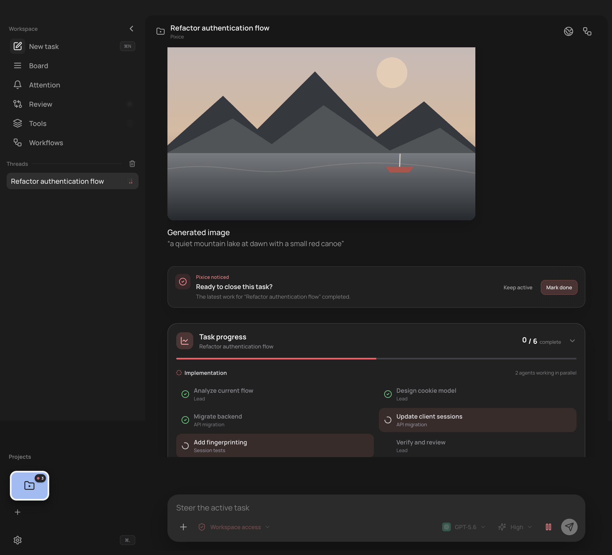
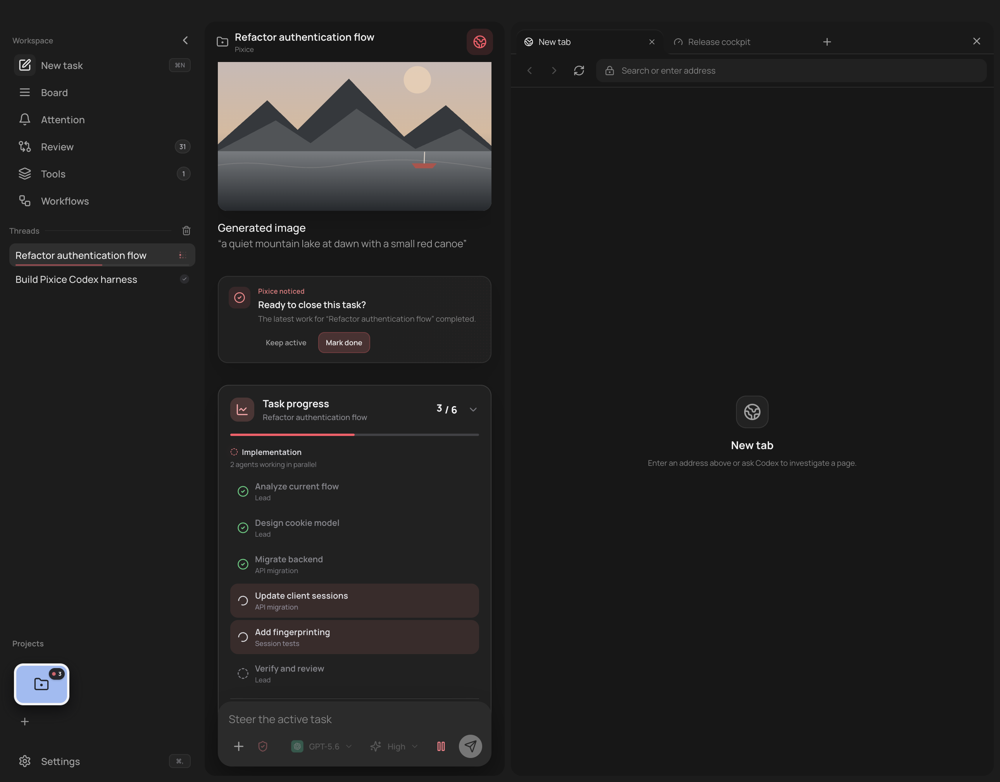
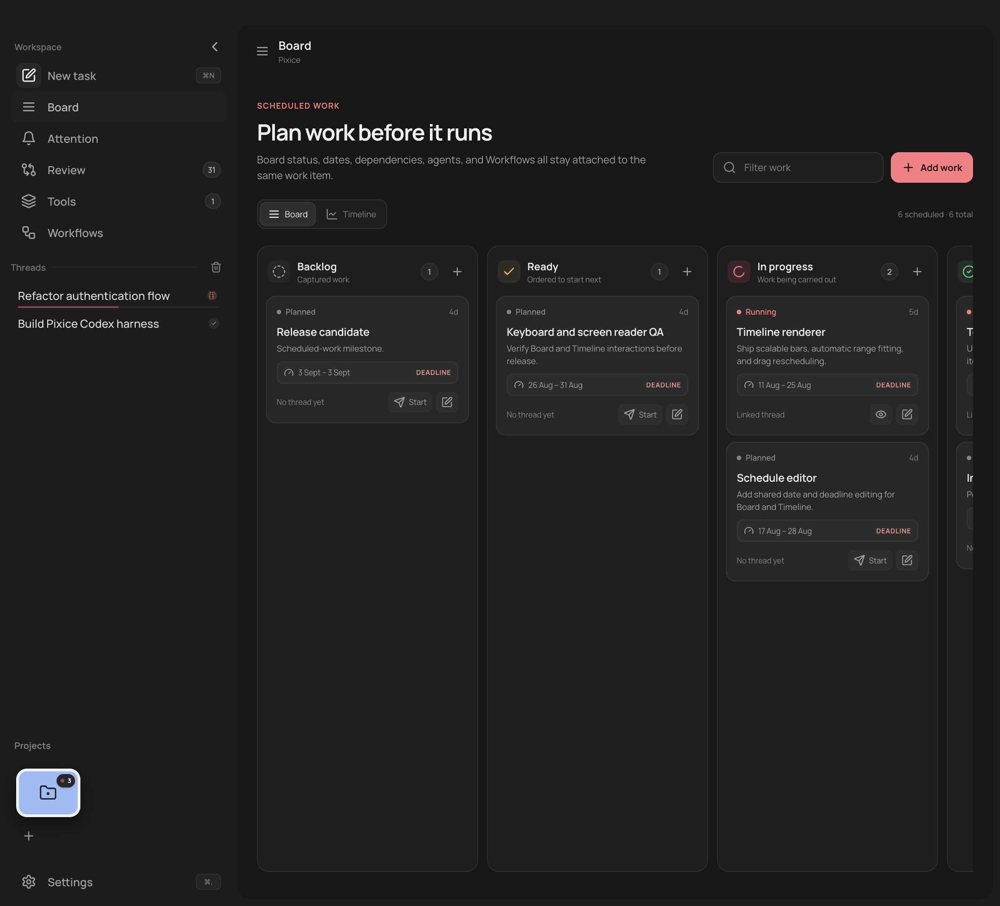
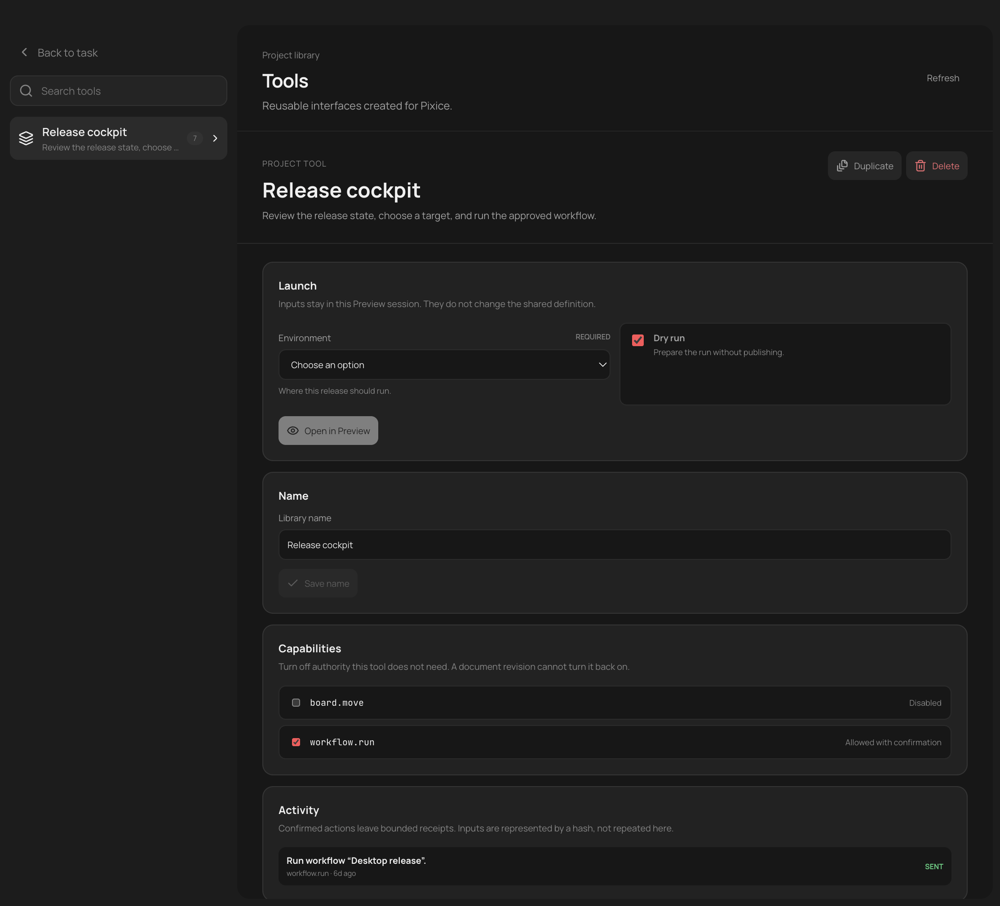
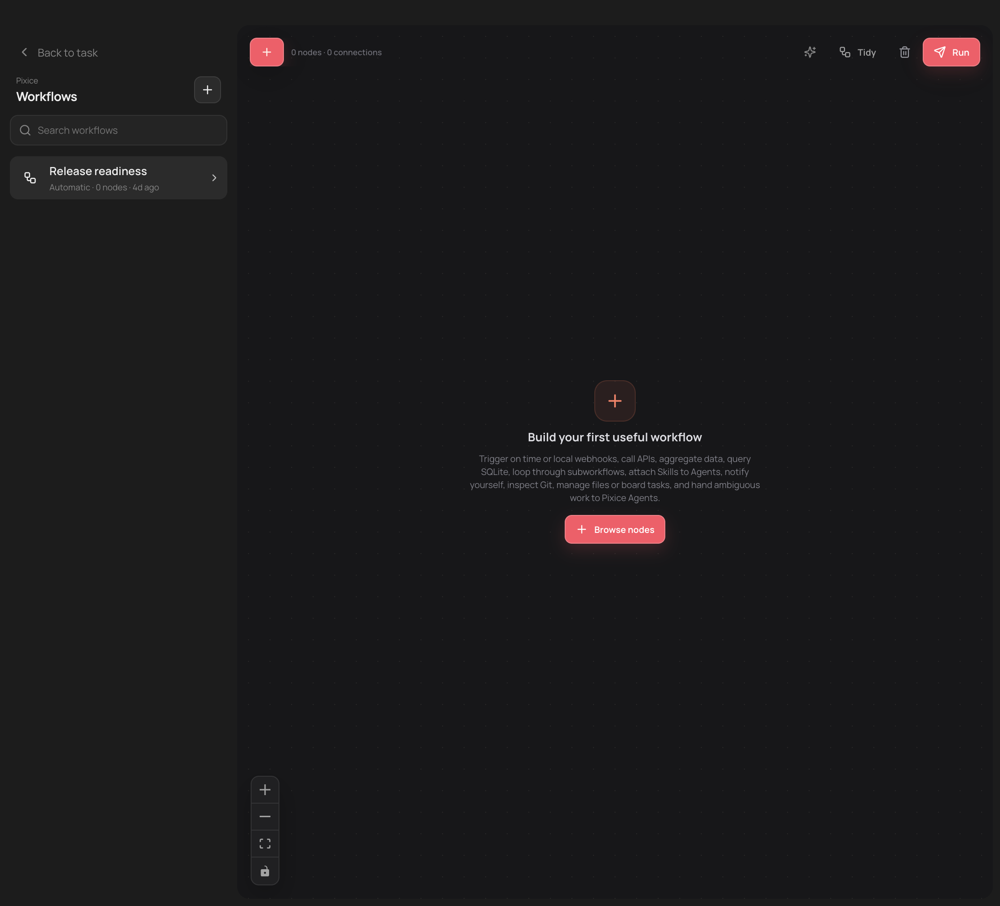
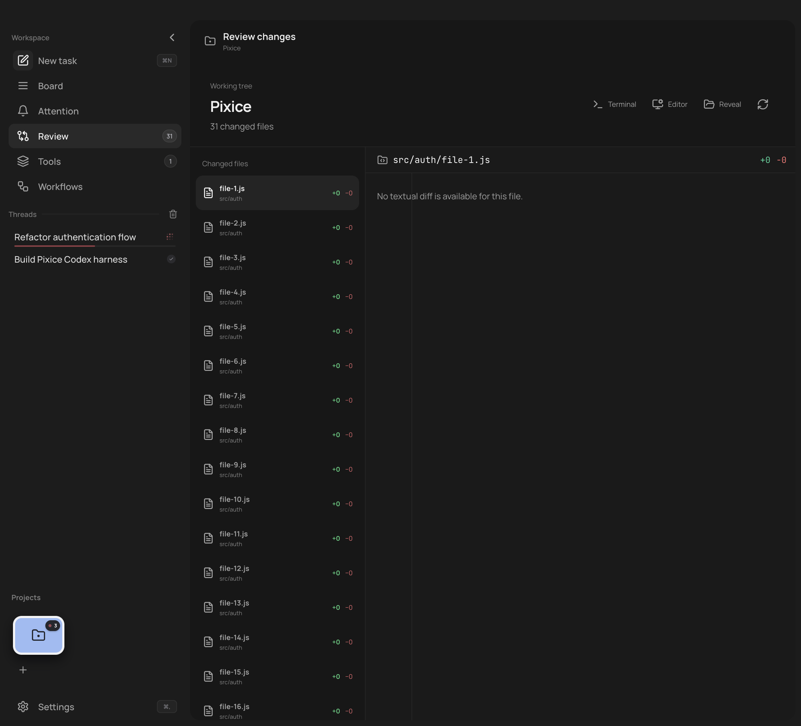
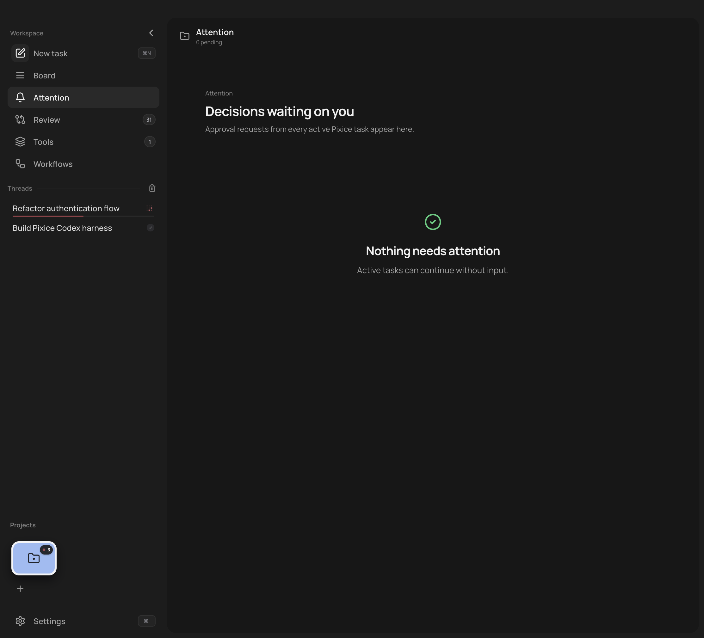
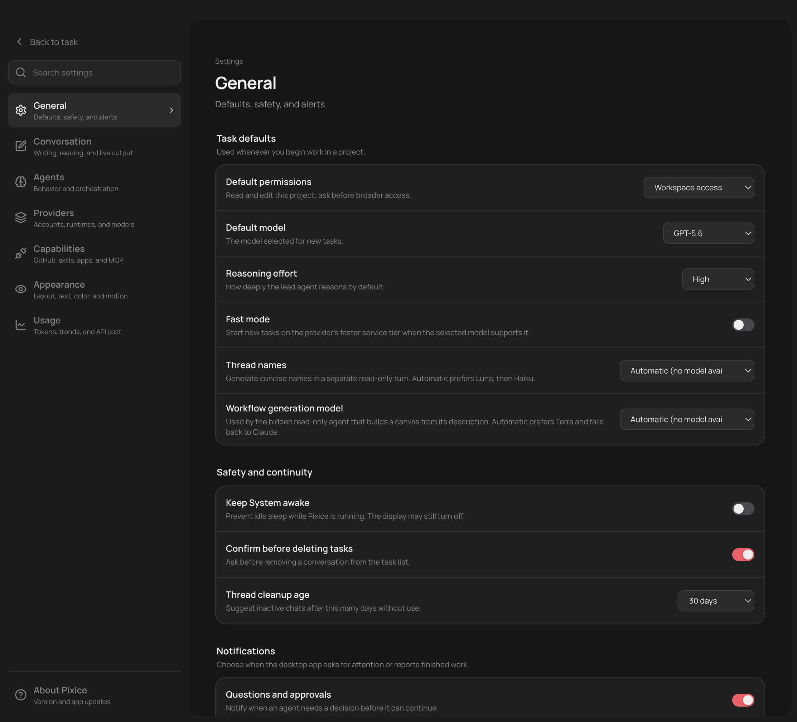
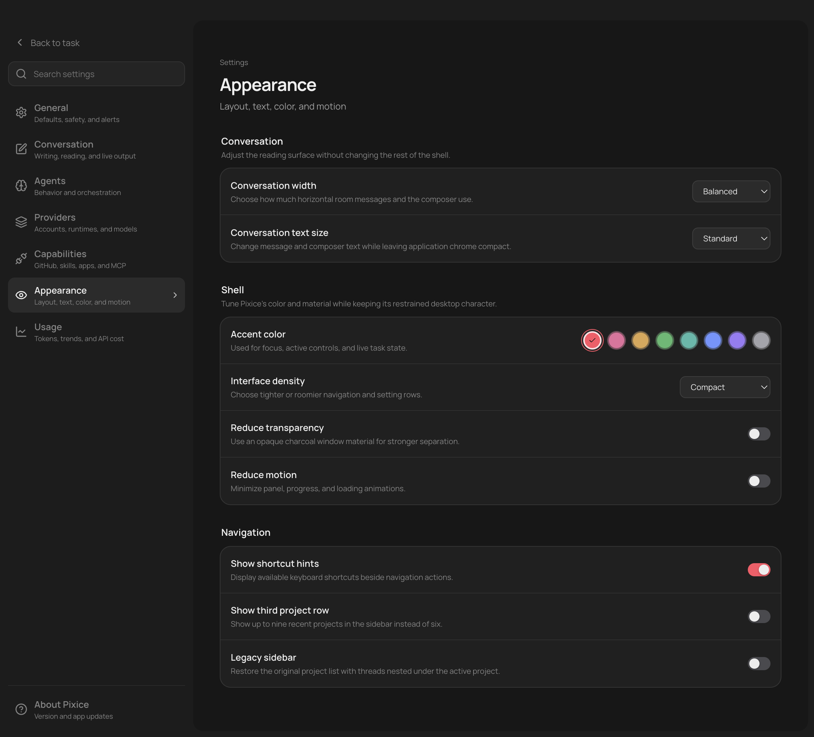

# Pixice premium product audit

## Verdict

Pixice already has product value that most coding clients do not. The combination of visible agent work, thread-specific Preview, Board, Workflows, Tools, Review, Attention, and multi-provider support is a real product system. The problem is not a lack of features. The problem is that the value is spread across too many equally weighted surfaces, while the core task experience can become visually crowded.

The best next version should feel calmer, faster, and more opinionated. Pixice should make its distinctive loop obvious: ask for work, watch it happen, inspect the result, and turn repeatable work into a tool or workflow.

## Audit walk-through

### 1. Active task workspace

Health: good foundation, crowded hierarchy.

The task workspace feels capable and alive. The generated result, suggestion card, task progress, composer, thread list, and global navigation all ask for attention at once. Task progress is useful, but it occupies too much space after the user understands what is running. The composer should remain the strongest control.

### 2. Preview workspace

Health: distinctive feature, weak default balance.

Preview is one of Pixice's best reasons to exist. In the captured split, the conversation becomes too narrow while the empty Preview pane consumes most of the screen. Opening Preview should trigger a responsive layout, collapse secondary task detail, and give a new tab useful starting actions or recent artifacts.

### 3. Board

Health: useful planning model, needs a desktop-native overview.

The board is clear, but later columns are clipped without a strong horizontal navigation cue. Cards carry more metadata than the scan needs. A fit-to-window overview, column focus, or visible next-column peek would make the state legible without turning Pixice into a small Jira.

### 4. Tools

Health: strong product value, fragmented shell.

Project Tools are a serious differentiator. The library and detail layout are polished, but entering Tools replaces the global shell with a separate "Back to task" structure. That makes Tools feel attached to Pixice instead of part of it. Keep the global spatial model stable and explain the difference between a Tool and a Workflow where the choice occurs.

### 5. Workflows

Health: premium visual direction, creation starts too low-level.

The workflow canvas looks like a flagship feature. The empty state should lead with outcomes and starter recipes, not node mechanics. A zero-node workflow should not present Run as a primary action. Tools and Workflows could share one Automate area while keeping their distinct jobs.

### 6. Review

Health: clear and practical, noisy at scale.

The split view is familiar and readable. Repeated `+0 / -0` rows add noise, and a long file list will need windowing. The implementation already loads the manifest first and fetches only the selected diff, which is a sound base.

### 7. Attention

Health: calm, but the empty state hides the background value.

"Nothing needs attention" is reassuring, but the empty canvas could also say what Pixice is handling: active tasks, last check time, and notification state. This surface can become the compact control room for autonomous work without becoming another dashboard.

### 8. General settings

Health: comprehensive, too much expert configuration up front.

The settings are readable and impressively complete. General mixes everyday choices with provider and automation details. Move rare controls to Advanced and make unavailable automatic-model states explicit instead of truncating them inside a select.

### 9. Appearance settings

Health: thoughtful customization, defaults must carry more of the burden.

Density, motion, transparency, width, and navigation controls show care. A premium product should feel right before users tune it. Treat these controls as escape hatches and keep refining one confident default.

## Ranked product program

### Priority 0: make the value obvious and calm the core loop

1. Define one product story across the shell: Work, Plan, Automate, Review. Keep Attention as a status layer rather than another equal destination.
2. Make Preview responsive. Preserve a useful conversation width, collapse secondary progress detail, and give empty Preview tabs recent artifacts and high-confidence actions.
3. Give task progress dynamic emphasis. Show the active phase compactly, collapse completed work, and keep detail one click away.
4. Rework first-run around the first useful outcome: connect a provider, open a project, complete a task, inspect the result.

### Priority 1: turn the distinctive features into a coherent system

1. Put Tools and Workflows under a shared Automate area with outcome-based templates.
2. Keep one global shell across task, Board, Tools, and Workflows.
3. Give Board an overview mode and reduce card metadata until focus or hover.
4. Make Attention prove that background work is under control, even when no action is required.

### Priority 2: remove speed and scale risks

1. Code-split Board, Workflows, Tools, Settings, and Review. The current renderer bundle is 1.04 MB minified, plus 297 KB of CSS.
2. Split the 7,314-line `App.jsx` so streaming task updates do not make the whole shell eligible to render.
3. Window long conversations and large Review file lists. Keep anchors so search and deep links still work.
4. Optimize the 1.7 MB renderer icon asset and keep desktop-only high-resolution variants outside the main renderer path.
5. Add performance budgets for cold start, view switching, composer input latency, streaming updates, and long-thread memory.

## Polish pass

- Standardize names, capitalization, badges, empty-state length, and status colors.
- Remove counts that lack a label or clear meaning.
- Disable actions that cannot succeed, especially Run on an empty workflow.
- Test keyboard focus, secondary-text contrast, and compact icon targets at every density.
- Use motion to explain state changes. Avoid motion on routine navigation and streaming updates.

## Evidence and limits

This audit used the current local app, source inspection, a production build, and the automated test suite. The production build passed. All 505 tests passed after the local webhook test was rerun outside the restricted sandbox. Browser Preview capture was used for visual evidence, so launch timing and transition timing were not treated as desktop performance measurements.
